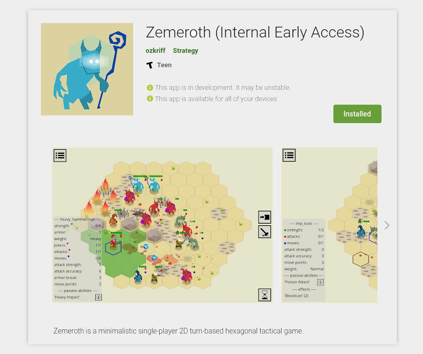
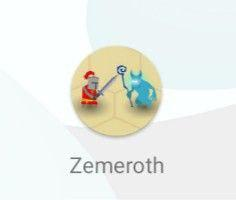

+++
title = "Publish game on Android with Macroquad"
description = "Step by step quide in setting up development environment, building a game for Android and publishing it on the android market."
date = 2021-06-15T09:19:42+00:00
updated = 2021-06-15T10:19:42+00:00
draft = false
template = "blog/page.html"

[taxonomies]
authors = ["Fedor"]
+++

[](https://play.google.com/store/apps/details?id=rust.zemeroth)

# 1. Introduction

This tutorial is based on the experience of publishing [Zemeroth](https://github.com/ozkriff/zemeroth) game on the Google Play Store. The game is now available as open test, [check it out!](https://play.google.com/store/apps/details?id=rust.zemeroth)

Topics covered:
- Building a macroquad game for android 
- Common pitfalls and debugging tips
- Setting up and uploading an APK to a Google Play

# 2. Setting up your Environment

## A docker way

On the machine with docker pulling all the NDK dependencies is as simple as

```
docker pull not-fl3/cargo-apk
```

Docker is a recommended way to build macroquad's game for Android. 

### Building an APK, a docker way

APK may be made with just one command:

```
docker run 
  --rm 
  -v $(pwd):/root/src 
  -w /root/src 
  notfl3/cargo-apk cargo quad-apk build --release
```

This will produce an apk in `target/android-artifacts/release/apk`. 

However this may take quite a while - each docker invocation will do a clean build for all 3 android targets.

One way to make it a little bit faster: add ` -v /tmp/registry\":/usr/local/cargo/registry\"` to a docker command. This will tell docker to use `/tmp/registry` on the host machine for cargo's registry, therefore docker will not download all the dependencies on each build.

If you get an error similar to: `failed to select a version for the requirement hashbrown = "=0.12.3"`
```
docker run 
  --rm 
  -v $(pwd):/root/src 
  -w /root/src 
  -it notfl3/cargo-apk bash -c "cargo update && cargo quad-apk build -
```

## A manual way

Docker simplify the process of installing android-sdk and android-ndk. But, sometimes, it may be more convinient to use all native build pipeline. 
While this is not really recommended, this path is included to a tutorial for better illustrating what exactly is going on in the container.

### Installing pre-requisites:

Exact commands and pathes may depend on the host OS. Here linux commands are used, but on all the other OSes the idea should be very similar.

- JRE or JDK

  This step highly depends on the OS, for ubuntu: 
  ```
  sudo apt-get install openjdk-8-jdk
  ```

- Rust android

  Assuming rustup's rust installation:

  ```
  rustup target add armv7-linux-androideabi
  rustup target add aarch64-linux-android
  rustup target add i686-linux-android
  rustup target add x86_64-linux-android
  ```

- Android SDK

  ```
  # create a folder for all the android pre-requisites stuff
  mkdir /this/may/be/any/path/android

  cd android
  wget -q https://dl.google.com/android/repository/sdk-tools-linux-4333796.zip
  unzip -q sdk-tools-linux-4333796.zip
  rm sdk-tools-linux-4333796.zip
  tools/bin/sdkmanager "platform-tools"
  tools/bin/sdkmanager "platforms;android-29"
  tools/bin/sdkmanager "build-tools;29.0.0"
  tools/bin/sdkmanager --update
  ```

- Android NDK

  ```
  # go to the same dir created for android-sdk
  cd /path/from/previous/step/android

  wget -q http://dl.google.com/android/repository/android-ndk-r20-linux-x86_64.zip
  unzip -q android-ndk-r20-linux-x86_64.zip
  rm android-ndk-r20-linux-x86_64.zip
  ```

- Cargo APK

  `cargo-quad-apk` is a cargo extension, allowing
  ```
  cargo install cargo-quad-apk
  ```

### Building an APK, a manual way

```
export ANDROID_HOME=/path/from/previous/step/android
export NDK_HOME=/path/from/previous/step/android/android-ndk-r20

# for a debug build
cargo quad-apk build
# for a release build
cargo quad-apk build --release
```

An apk will be in `target/android-artifacts/debug/apk` or `target/android-artifacts/release/apk`.

# 3. Fine tuning the game for android

## Assets folder

Assuming following project structure: 
```
.
├── assets
├── └── nice_texture.png
├── src
├── └── main.rs
└── Cargo.toml
```

To include assets folder to an APK, add this to your Cargo.toml:

```ini
[package.metadata.android]
assets = "assets/"
```

Later on texture may be loaded with `load_texture("nice_texture.png")`.

However, on PC, usually, the load_texture call will look like `load_texture("assets/nice_texture.png")` - the assets folder itself is a part of the path.

To fix it and use uniforms path between android and PC [set_pc_assets_folder](https://docs.rs/macroquad/0.3.6/macroquad/file/fn.set_pc_assets_folder.html) may help.

```
macroquad::file::set_pc_assets_folder("assets");
```

Now its `load_texture("nice_texture.png")` on both platforms.

## High-dpi


*[Image source](https://developer.android.com/training/multiscreen/screendensities)*

Android devices have significant pixel dencity difference. 
By default, android tries to emulate a low-density display on a high-density pixel display.  

This means that `screen_width()/screen_height()` may give a value way lower than the actual screen pixel resolution, but later on android will automatically upscale the viewport.  

This may be OK - smaller viewport means better FPS, but if android's upscale is not required - the game should tell android to support "high-dpi" screens.

```rust
fn window_conf() -> window::Conf {
    window::Conf {
        window_title: "Zemeroth".to_owned(),
        high_dpi: true,
        ..Default::default()
    }
}

#[macroquad::main(window_conf)]
async fn main() {
}
```

## Screen orientation

By default Macroquad games are fullscreen and allows any screen locations.
To limit possible screen orientations add this to your Cargo.toml: 

```ini
[package.metadata.android.activity_attributes]
"android:screenOrientation" = "userLandscape"
```

## Icon



Application icon lives in an "resources" - special section in APK.
To include "res" folder to an APK:

```ini
[package.metadata.android]
res = "android_res"
icon = "@mipmap/ic_launcher"
```

And the icon itself for different DPI may look something like this:

```
android_res/
├── mipmap-hdpi
│   └── ic_launcher.png
├── mipmap-mdpi
│   └── ic_launcher.png
├── mipmap-xhdpi
│   └── ic_launcher.png
├── mipmap-xxhdpi
│   └── ic_launcher.png
└── mipmap-xxxhdpi
    └── ic_launcher.png
```

Icons for each size certainly may be generated manually. For this tutorial 
[http://romannurik.github.io/AndroidAssetStudio/icons-launcher.html](http://romannurik.github.io/AndroidAssetStudio/icons-launcher.html) was used, worked pretty good.

## Debug logs

All the `warn!`/`info!`/`debug!` macroquad's messages goes into android system messages. To access android's system messages there is `adb logcat` command. There are various way to filter `adb logcat`.

### Filter `adb logcat` by tag

Filter by tag will show only messages posted by macroquad's `warn!`/`info!`/`debug!`.

```
adb logcat -v brief SAPP:V "*:S"
```

`-v brief` will save a little bit of screen space, hiding some log metadata.

Arguments after `adb logcat` are filter specification.

SAPP:V - For messages with tag SAPP V(verbose) filter will be applied. All the SAPP messages will be in the output.
*:S - For all the other tags S(silent) filter will be applied. All the other messages will be filtered out.

### Filter by PID

Sometimes application produced some extra system messages. It may be some system warnings or some unhandled native libraries problems. But those messages may be filtered out when `adb logcat` is filtered by tag.

PID is a process id, and filtering by PID will give all the application output, with any tag.


```
# Find out PID
> adb shell pidof -s rust.CRATENAME
30243
# Get all the messages from a given PID
>adb shell pidof -s 30243
```

Depending on the command processor those to commands may be usually reduced to something like
```
adb logcat --pid=$(adb shell pidof -s rust.CRATENAME)
```

# 4. Signing the APK

By default, `cargo quad-apk` generates debug kestore file and is signing up an APK with a debug key. This allows the APK to be installed locally, but is not enough for the Google Play.

For the Play Store non-debug keystore file is required, and this file should be uploaded to the Play Console to verify developer identity. 

To generate the key `keytool` is required. `keytool` is a part of a `java` ditribution and is being shipped with `openjdk`.
To sign the the APK `apksigner` is requires. `apksigner` is a part of Android SDK. 

```
keytool -v -genkey -keystore mygame.keystore -alias mygame -keyalg RSA -validity 10000
```

Now all the pre-requisites are fullfilled and the key is ready to be used for a release build.

First, tell `cargo-apk` to stop signing the build with debug keystore:
`cargo quad-apk build --release --nosign`

Than sign the APK with a non-debug keystore file:

```
apksigner sign --ks mygame.keystore my-app.apk --ks-key-alias alias_name
```

It may be verified with
```
apksigner verify my-app.apk

```
[The official documentation on signing can be found here.](https://developer.android.com/studio/publish/app-signing.html#signing-manually).

## NOTE: how to get `keytool`/`apksigner` with docker

Assuming android keystore lives in ~/.android and .apk to sign lives in current working directory: 

```
docker run --rm 
    -v (pwd):/root/src  
    -v(/home/USER/.android):/root/.android_secrets 
    -w /root/src -it notfl3/cargo-apk /bin/bash
```

This command will gives a bash session with current directory mounted to `/root/src` and .android mounted to `/root/.android_secrets`
And inside the container APK may be signed with

```
apksigner sign --ks my.keystore my-app.apk --ks-key-alias alias_name
```

## Android targets

By default `cargo quad-apk` is building an APK for 3 different platforms. 
To comply Google Play requirements and get all the platforms:
```ini
[package.metadata.android]
..
build_targets = [ "armv7-linux-androideabi", "aarch64-linux-android", "i686-linux-android", "x86_64-linux-android" ]
```

To reduce build time while debugging - pick one for a testing device in use:
```ini
[package.metadata.android]
..
build_targets = [ "armv7-linux-androideabi" ]
```

## Google Play versioning

Google play have its own versioning mechanism for uploaded APKs.
Each APK for google play should have unique `version_code`.
Otherwise google developer console will end up with `Version code 1 has already been used. Try another version code."`.

To set `version_code` from an app Cargo.toml:

```ini
[package.metadata.android]
..
version_code = 2
version_name = "Version Name"
```

[The official documentation on versioning can be found here.](https://developer.android.com/studio/publish/versioning).

## Preview assets for a store page

To submit your game for a google review and do an open test/release - the Play Store page should be filled setted up - screenshots/descriptions should be uploaded. Lots of data will be marked as (*)required, however, the real minimal subset of game graphics to upload is:
- 512x512 icon
- 1024x500 banner
- two 16:9 screenshots

[Useful article on preview assets.](https://developer.android.com/studio/publish/versioning).

## Internal test, open test and release

*Difference between an internal, closed, and open test?*
*You can create releases on three testing tracks before you release your app to production.*

*Internal testing: Create an internal testing release to quickly distribute your app to up to 100 testers for initial quality assurance checks.*

Do not require setted up store page and do not require a review. Helps with ensuring that signing process actually worked, build is really uploaded. Also allows to add testers by email.

*Closed testing: Create a closed testing release to test pre-release versions of your app with a wider set of testers to gather more targeted feedback.*

Almost an open test, but requires adding tester's email.

*Open testing: Create an open testing release to run a test with a large group and surface your app's test version on Google Play. If you run an open test, anyone can join your testing program and submit private feedback to you.*

Almost a release, page is publicly available, no additional actions from testers required to install the game.

[More info on testing tracks can be found here.](https://support.google.com/googleplay/android-developer/answer/9845334?hl=en)
